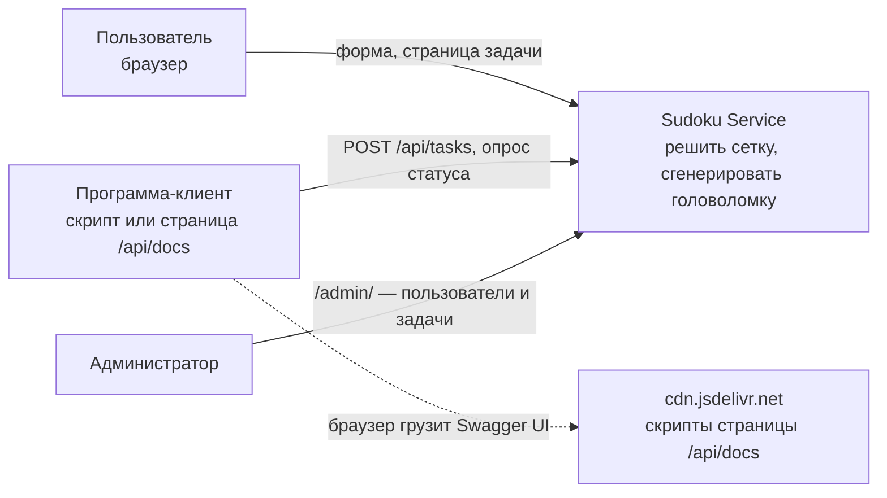
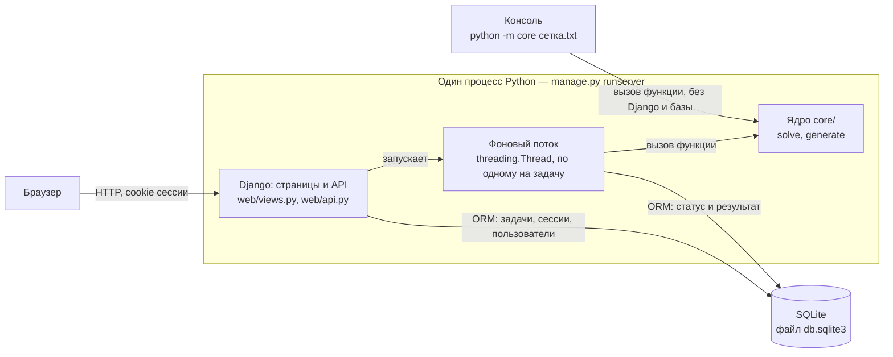
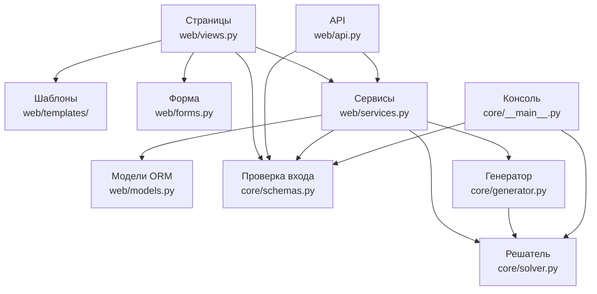
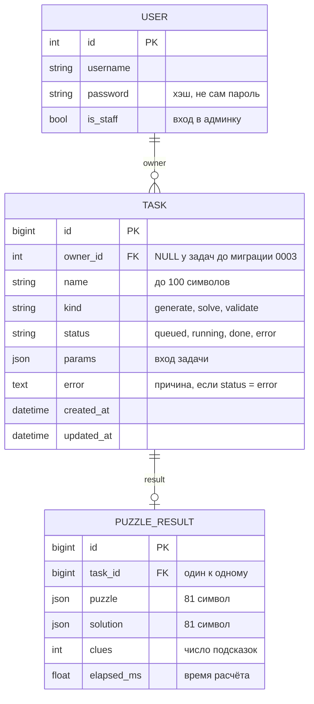
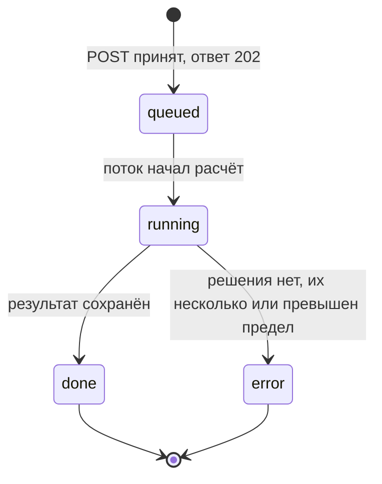
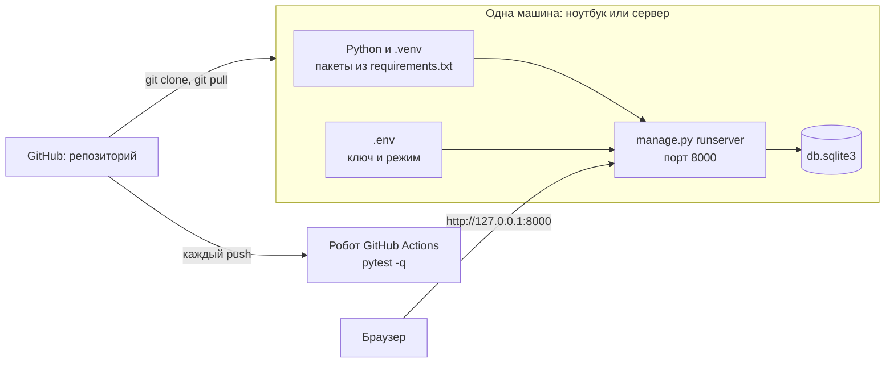

# Архитектура проекта Sudoku Service

> Архитектурный документ, 12 разделов по шаблону стартера
> (`calc-service-starter/docs/architecture.md`). Версия от 02.10.2026 (пара 16).
> Команда «Судоку»: Ташлигов Ахмед, Умаров Зелим, Альсиев Идрис, Байраев Магомед-Эми.
>
> Правила, по которым написан документ: коротко и фактами; у каждого
> утверждения — файл (и строка), где это в коде; числа — из наших замеров и
> тестов; решения — ссылкой на ADR, без пересказа. Под заголовком раздела —
> автор: разделы поделены по «Вкладу» в README, каждый пишет о своих файлах.
> Номера строк — по состоянию кода на 02.10. Диаграммы — Mermaid (GitHub
> рисует их сам) и `docs/ER.png`.

| Раздел | Автор | Раздел | Автор |
|---|---|---|---|
| 1. Назначение | Умаров Зелим | 7. Ядро | Байраев Магомед-Эми |
| 2. Требования | Ташлигов Ахмед | 8. Безопасность | Умаров Зелим |
| 3. Контейнеры | Альсиев Идрис | 9. Развёртывание | Ташлигов Ахмед |
| 4. Слои | Умаров Зелим | 10. Эксплуатация | Альсиев Идрис |
| 5. Модель данных | Альсиев Идрис | 11. Решения | Байраев Магомед-Эми |
| 6. API | Ташлигов Ахмед | 12. Ретроспектива и AI | Байраев Магомед-Эми |

## 1. Назначение и контекст
Автор: Умаров Зелим

Что делает: веб-сервис для судоку 9×9 с двумя режимами (`core/schemas.py:23`).
- **Решить** готовую сетку — и доказать, что решение единственное.
- **Сгенерировать** новую головоломку, у которой решение гарантированно одно.

Для кого: человек — форма с сеткой 9×9 (`web/templates/web/index.html`);
программа — `POST /api/tasks` (`web/api.py:25`). Вход у обоих один и тот же:
`core.schemas.SudokuParams` (`core/schemas.py:16`).

Вычислительная задача: перебор с возвратом. «Тяжёлая» часть — не найти
решение, а доказать, что второго нет: перебор не останавливается на первом
решении, а ищет второе (`core/solver.py:114`, `limit=2`). Генератор делает
такую проверку после каждой убранной клетки (`core/generator.py:99`).
Откуда идея и проверка «тремя вопросами» — `docs/idea.md`.

Границы.

| Делаем | Сознательно не делаем |
|---|---|
| Сетка 9×9, строка из 81 символа | Другие размеры и варианты судоку |
| Решение + доказательство единственности | Пошаговые подсказки, объяснение хода решения |
| Генерация easy / medium / hard, повторяемая по `seed` | Оценка сложности «как для человека»: сложность — это число подсказок (`core/generator.py:28`) |
| Вход и «только свои задачи» | Регистрация: пользователей заводит админ ([ADR-003](ADR-003.md)) |
| Создать задачу, статус, результат в API | Список задач в API (`GET /api/tasks` нет; список есть только на главной странице) |
| Предел перебора | Ограничение частоты запросов (план — `docs/security_review.md`, пункт 4) |

Контекст (C4, уровень 1):

Внешних систем у сервиса нет: ни почты, ни платежей, ни чужих API.
Единственное внешнее — скрипты страницы `/api/docs`: Django Ninja берёт их с
CDN (в `INSTALLED_APPS` нет `ninja`, `sudoku_service/settings.py:30–38`).
Сам API от этого не зависит.

## 2. Требования и ограничения
Автор: Ташлигов Ахмед

Ключевые требования и где они выполнены.

| Требование | Где в коде | Чем проверено |
|---|---|---|
| Один договор на два входа: форма и API принимают одни и те же поля | `core/schemas.py:16`; форма собирает `SudokuParams` в `web/views.py:54–59`, API — в `web/api.py:22` | `tests/test_site.py`, `tests/test_api.py` |
| Расчёт не в запросе: `202` и номер сразу, результат — потом | `web/api.py:25–28`, `web/services.py:33–36` | `test_create_task_returns_202_and_id_then_result` |
| Ответ проверяем: эталон с ответом не из нашего кода | `core/tests/test_solver.py`, `core/tests/test_reference_puzzle.py` | головоломка Википедии и сетка Инкалы (2012) |
| Плохой вход — отказ до расчёта, с именем поля | `core/schemas.py:31–59`, `web/api.py:21` | `tests/test_security.py`, `core/tests/test_schemas.py` |
| Только свои задачи | `web/services.py:114` | `tests/test_access.py` |
| Ядро запускается без сайта | `core/__main__.py` | `core/tests/test_cli.py` |
| Запуск по README на чистой машине | README, «Запуск с чистой машины» | робот: `.github/workflows/tests.yml` |

Ограничения.
- Команда: 4 человека. Сроки: сдача межсессии 28.09, КТ2 02.10, предсдача
  02.11, защита 09.11.
- Стек задан стартером курса: Python, Django, Django Ninja, pydantic, pytest,
  ruff. Версии закреплены: `Django==5.2.17`, `django-ninja==1.7.1`,
  `pydantic==2.13.5` (`requirements.txt`).
- Среда: один процесс, база SQLite в файле, без Docker, без Redis, без
  отдельного веб-сервера. Робот проверяет на Python 3.12
  (`.github/workflows/tests.yml:14`).

Качественные атрибуты.

| Главные | Чем пожертвовали |
|---|---|
| Корректность: единственность решения доказана перебором, а не «скорее всего» | Надёжность фона: перезапуск посреди расчёта — задача навсегда «считается» ([ADR-002](ADR-002.md)) |
| Простота запуска: 8 команд из README, ничего кроме Python | Масштаб: один процесс и SQLite, нагрузку не держим и не замеряли |
| Предсказуемое время: решение сетки не дольше ~4 с (предел перебора, раздел 7) | Часть честных, но очень сложных сеток получит «превышен предел» вместо решения |

Риски.

| Риск | Что будет | Состояние |
|---|---|---|
| Перезапуск сервера посреди расчёта | задача остаётся `running` навсегда | открыт, [ADR-002](ADR-002.md); что делать администратору — раздел 10 |
| Много запросов от одного пользователя | на каждую задачу — свой поток, предела числа потоков нет | открыт, план — `docs/security_review.md`, пункт 4 |
| Одновременная запись в SQLite | `database is locked`; у нас проявилось в тестах (`web_task`) | в тестах закрыт (`tests/conftest.py:20`), для сервера открыт |
| Сетка без решения занимает сервер | было больше 150 с | закрыт: `core/solver.py:23`, предел 50 000 шагов |

## 3. Контейнеры (C4 уровень 2)
Автор: Альсиев Идрис

| Контейнер | Что это | Что в нём выполняется | Как общается |
|---|---|---|---|
| Веб-приложение | Django в процессе `runserver` | приём запроса, проверка входа, страницы, API | HTTP с браузером; ORM с базой |
| Фоновый поток | `threading.Thread` внутри того же процесса (`web/services.py:34`) | один расчёт: статус `running` → ядро → результат → `done` или `error` (`web/services.py:40–53`) | вызывает функции ядра; пишет в базу через ORM |
| Ядро | пакет `core/`, обычные функции Python | перебор | ничего не знает о вызывающем: строка на вход, строка на выход |
| База | один файл `db.sqlite3` | задачи, результаты, пользователи, сессии | только через ORM Django |
| Консоль | `core/__main__.py` | то же ядро без сайта | читает файл, печатает ответ |

Чего нет и почему.
- **Брокера и отдельного воркера** (Celery, Redis) нет — [ADR-002](ADR-002.md).
  Цена решения там же: поток живёт внутри процесса и умирает вместе с ним.
- **Файлового хранилища** нет: результат — две строки по 81 символу, они лежат
  прямо в таблице (раздел 5).
- **Отдельного веб-сервера** (nginx, gunicorn) нет — раздел 9.

Статус задачи хранится только в базе (`Task.status`, `web/models.py:24–26`),
в памяти процесса списка задач нет. Поэтому страница и API читают статус
одинаково, а после перезапуска видно, в каком состоянии была задача.

В тестах потока нет: `tests/conftest.py:20` ставит `RUN_IN_THREAD = False`,
и расчёт идёт сразу (`web/services.py:36`). Что в обычном режиме поток
по-прежнему запускается, проверяет `test_normal_mode_still_uses_background_thread`.

## 4. Компоненты веб-приложения (C4 уровень 3, кратко)
Автор: Умаров Зелим

Правило зависимостей: стрелки идут только сверху вниз. Веб-слой → сервисы →
ядро; ядро не знает ни о ком.

| Слой | Файлы | Что делает | Чего не делает |
|---|---|---|---|
| Веб-слой | `web/views.py`, `web/api.py`, `web/forms.py`, шаблоны | принимает запрос, собирает `SudokuParams`, отдаёт страницу или код ответа | не считает и не проверяет правила судоку |
| Сервисы | `web/services.py` | создаёт задачу, запускает расчёт, пишет статус и результат, фильтрует по владельцу | не формирует HTTP-ответ, не содержит алгоритма |
| Ядро | `core/schemas.py`, `core/solver.py`, `core/generator.py`, `core/__main__.py` | проверка входа, перебор, генерация | не импортирует Django, не ходит в базу и в сеть |
| Инфраструктура | `web/models.py`, `web/migrations/`, `sudoku_service/settings.py` | таблицы, настройки | — |

Как соблюдено правило и чем это проверено.
- В `core/` нет ни одного импорта Django. Тест
  `core/tests/test_cli.py::test_runs_as_module_without_django` запускает ядро
  отдельным процессом и проверяет, что Django при этом не загружен.
- API и страницы ходят в ядро только через сервисы: в `web/api.py` три
  функции, каждая — вызов `services.*` и код ответа (`web/api.py:25–63`).
- Правило «только свои» — в одном месте (`web/services.py:114`); его
  вызывают и страница (`web/views.py:99`), и API (`web/api.py:33`, `:58`).
- Самопроверка на «толстые» функции по пяти пунктам — `docs/fat_review.md`.

Два места, где слои соприкасаются плотнее, чем на схеме.
- `web/forms.py` объявляет те же четыре поля руками (`mode`, `grid`,
  `difficulty`, `seed`). Имена совпадают с `core/schemas.py`, но совпадение
  держится на нас, а не на коде. Правила проверяет только схема: форма
  передаёт данные в `SudokuParams` (`web/views.py:54–59`).
- `web/views.py:14` импортирует `Task` из моделей — только ради названий
  статусов (`Task.Status.DONE`), запросов к базе в страницах нет.

## 5. Модель данных
Автор: Альсиев Идрис

Схема — `docs/ER.png` (перерисована 02.10: добавлены `owner`, `name`,
`error` и таблица пользователей). То же в виде, который GitHub рисует сам:

| Сущность | Где | Зачем | Когда меняется |
|---|---|---|---|
| `User` | встроенная таблица Django | кто вошёл; пароль хранится хэшем | заводит админ |
| `Task` | `web/models.py:8–47` | заявка: что считать, чья, в каком состоянии | создаётся запросом, статус меняет поток |
| `PuzzleResult` | `web/models.py:50–66` | результат: головоломка, решение, число подсказок, время | создаётся один раз при `done`, дальше не меняется |

Связи: у пользователя много задач (`owner`, `web/models.py:35–41`); у задачи
ноль или один результат (`OneToOneField`, `web/models.py:57–59`). У задачи с
ошибкой результата нет — причина лежит в `Task.error`. Удаление каскадное:
пользователь → его задачи → их результаты.

Где большие результаты и почему: больших нет. Сетка и решение — строки по 81
символу, около 100 байт. Они лежат прямо в таблице, в `JSONField`. Файл
понадобился бы для мегабайтов — у нас такого нет.

Миграции: `web/migrations/0001_initial.py`, `0002_task_error_task_name.py`,
`0003_task_owner.py`. Третья проверена на базе со старыми задачами: `owner`
допускает `NULL`, поэтому миграция не падает; такие задачи не видит никто,
кроме админки ([ADR-003](ADR-003.md)).

Расхождения, о которых знаем.
- `kind = validate` объявлен в модели (`web/models.py:14`), но схема входа его
  не принимает (`core/schemas.py:23`: только `solve` и `generate`). Таких
  задач в базе не бывает.
- SQLite не проверяет `max_length`: длина имени ограничена не моделью, а
  схемой API (`web/api.py:21`).

## 6. API
Автор: Ташлигов Ахмед

Документация в браузере — `/api/docs` (Swagger, Django Ninja строит её по
коду). Письменная копия с примерами тел — `docs/api.md`. Всё — после входа:
`NinjaAPI(auth=django_auth)` (`web/api.py:15`), та же cookie, что у сайта.

| Метод | Адрес | Что делает | Запрос | Ответы | Где |
|---|---|---|---|---|---|
| `POST` | `/api/tasks` | создать задачу | `{"name": "...", "params": {...}}` | `202` и `{"id": 7}`; `422`; `401` | `web/api.py:25–28` |
| `GET` | `/api/tasks/{id}` | статус | — | `200`; `404`; `401` | `web/api.py:31–41` |
| `GET` | `/api/tasks/{id}/result` | результат | — | `200`; `409`; `404`; `401` | `web/api.py:44–63` |

Поля `params` (`core/schemas.py:23–29`): `mode` — `solve` или `generate`;
`grid` — 81 символ, обязателен для `solve`; `difficulty` — `easy`, `medium`,
`hard`; `seed` — от 0 до 2³²−1. `name` — до 100 символов (`web/api.py:21`).

Что значат ответы и как выглядит тело (сверено запросами 02.10).

| Код | Смысл | Тело |
|---|---|---|
| `202` | принято, расчёт идёт в фоне | `{"id": 7}` |
| `200` | статус или готовый результат | `{"id", "name", "status", "error"}` или `{"puzzle", "solution", "clues", "elapsed_ms"}` |
| `422` | ошибка в данных, расчёт не начинался, задача не создана | `{"detail": [{"type", "loc", "msg"}]}` — в `loc` имя поля |
| `401` | не вошли | `{"detail": "Unauthorized"}` |
| `404` | задачи нет **или она чужая** — для клиента неотличимо | `{"detail": "Not Found"}` |
| `409` | задача есть, но не готова — спросите позже | `{"detail": "статус: running"}` |

Формат ошибок один: поле `detail`. Строка — для `401`, `404`, `409`; список с
именем поля — для `422`. Почему чужая задача — `404`, а не `403`, и откуда
`403` у запроса без CSRF-токена — [ADR-003](ADR-003.md).

Состояния задачи (`web/models.py:16–20`, переходы — `web/services.py:40–53`):

`/result` отвечает `200` только из `done`; из `queued`, `running` и `error` —
`409` с текущим статусом (`web/api.py:61–62`). Причину ошибки клиент читает в
поле `error` статуса. Обратных переходов нет: упавшую задачу не
перезапускают, создают новую.

Чего в API нет: списка задач, удаления, отмены расчёта.

## 7. Вычислительное ядро
Автор: Байраев Магомед-Эми

Что считает: решение судоку 9×9 перебором с возвратом. Следующей берётся
пустая клетка с наименьшим числом вариантов (`core/solver.py:45–59`). Перебор
ищет до двух решений (`core/solver.py:114`): одно — решение единственное,
два — сетка неоднозначна.

Договор.

| | Решатель `solve(grid)` | Генератор `generate(difficulty, seed)` |
|---|---|---|
| Где | `core/solver.py:98` | `core/generator.py:72` |
| Вход | строка из 81 символа: `1`–`9` и `.` | `easy` / `medium` / `hard`; `seed` — целое или пусто |
| Выход | решение (81 цифра) либо причина: `multiple`, `no solution`, `too complex` | пара (головоломка, решение), обе по 81 символу |
| Ошибки | длина не 81 → `ValueError` (`core/solver.py:110–111`) | — |

Вход проверяется до расчёта, в `core/schemas.py`: длина и символы (`:24`),
повтор цифры в строке, столбце или блоке (`:41–59`), `solve` без сетки
(`:31–39`), границы `seed` (`:29`). Плохой вход → `422`, расчёт не начинается.

Версия договора: номера версии нет. Договор менялся один раз — на паре 14
добавлен третий исход `too complex` (`core/solver.py:24`); его учитывают
сервис (`web/services.py:67–74`) и генератор (`core/generator.py:99`).

Как проверяем: ответы известны заранее, не из нашего кода.
- Головоломка Википедии, 30 подсказок, решение опубликовано вместе с
  условием — `core/tests/test_solver.py`.
- «Самая сложная в мире» (Арто Инкала, 2012), 21 подсказка —
  `core/tests/test_reference_puzzle.py`.
- Генератор: `seed=42` даёт одну и ту же головоломку, в том числе в другом
  процессе, и решение у неё одно — `core/tests/test_generator.py`.
- Пределы: `core/tests/test_limits.py`. Консоль: `core/tests/test_cli.py`.

Тестов ядра — 30, все идут без Django и без базы.

Сколько считает (замер пары 11, 10 запросов на вход, таблица в README).

| Вход | Среднее | Наибольшее | Шагов перебора |
|---|---|---|---|
| Классическая (Википедия, 30 подсказок) | 3.75 мс | 5.30 мс | 52 |
| Инкала (21 подсказка) | 1769.71 мс | 1990.21 мс | 18 936 |
| Генерация `hard` (10 разных `seed`) | 292.92 мс | 564.80 мс | до 1 275 на один вызов `solve` |
| Сетка Норвига без решения, до предела | больше 150 с | — | больше 2 000 000, не закончила |
| Она же, с пределом | около 3 с в консоли, 4.2 с через сайт | — | 50 000, затем остановка |

Ограничения.
- Время: предел `MAX_STEPS = 50_000` шагов (`core/solver.py:23`, проверка —
  `:77–78`). Число выбрано по замеру: в 2.6 раза больше, чем нужно Инкале.
  Превышен → `too complex` → статус «Ошибка: превышен предел перебора».
- Память: не растёт. Глубина рекурсии — не больше числа пустых клеток (81),
  сетка — список из 81 символа.
- Повторяемость: кандидаты перебираются в отсортированном порядке
  (`core/solver.py:87`, `core/generator.py:59`). Иначе число шагов и результат
  генератора менялись бы от запуска к запуску.
- Число подсказок у генератора — не больше цели (40 / 32 / 26,
  `core/generator.py:28`), но может быть больше, если дальше убирать клетки
  нельзя без потери единственности.

Почему в фоне: Инкала считается 1.8 с, а время зависит от сетки нелинейно —
[ADR-002](ADR-002.md).

Запуск без сайта: `python -m core сетка.txt` (`core/__main__.py`). Тот же
путь, что у сайта: сначала схема, потом `solve`. Печатает решение или
причину; код выхода 0 — решено, 1 — решения нет, 2 — вызвали неправильно.

## 8. Безопасность и доступ
Автор: Умаров Зелим

Аутентификация: готовый вход Django (`sudoku_service/urls.py:7`, страница
`web/templates/registration/login.html`). Пароли хранит Django — хэш с солью,
сами пароли мы не храним и не сравниваем. Сайт — `@login_required`
(`web/views.py:47`, `:90`), API — `auth=django_auth` (`web/api.py:15`).

Роли.

| Кто | Что может | Где правило |
|---|---|---|
| Аноним | только страница входа; сайт → `302` на вход, API → `401` | `web/views.py:47`, `:90`; `web/api.py:15` |
| Пользователь | создавать задачи, видеть только свои; чужая → `404` | `web/services.py:114`, `:121` |
| Администратор (`is_staff`) | `/admin/`: пользователи, все задачи и результаты | `web/admin.py` |

Что защищает фреймворк, а не мы.

| Угроза | Чем закрыта | Как мы это проверили |
|---|---|---|
| Подделка запроса с чужого сайта (CSRF) | `CsrfViewMiddleware`, `` в формах; API проверяет токен через `django_auth` | `test_post_without_csrf_token_is_rejected` |
| Вставка скрипта через имя задачи (XSS) | шаблоны Django экранируют `{{ }}`; `safe` нигде нет | `test_task_name_is_shown_as_text_not_html` |
| SQL-инъекция | все запросы через ORM; `.raw(`, `.extra(`, `cursor.execute` не найдено | поиск по коду, `docs/security_review.md`, пункт 7 |
| Кража паролей из базы | хэш pbkdf2 с солью | — |

Секреты: только в `.env`, файл не в git (`.gitignore`). `SECRET_KEY` — из
окружения; без ключа и с выключенным `DEBUG` сервер не стартует
(`sudoku_service/settings.py:18–27`). `DEBUG` по умолчанию выключен
(`sudoku_service/settings.py:16`).

Какие угрозы проверены: восемь пунктов пары 14, по каждому — где, как
воспроизвести, исправлено или план — `docs/security_review.md`. Итог:
исправлено шесть находок, без находок четыре пункта.

Что открыто.
- Ограничения частоты запросов нет (`docs/security_review.md`, пункт 4).
- Страница `/api/docs` и `/api/openapi.json` открываются без входа (проверено
  02.10: `200`). Аноним видит список адресов API, но любой вызов — `401`.
- HTTPS нет: `runserver` отдаёт по HTTP, cookie сессии без флага `Secure`.
  Для сервера в сети это нужно закрыть (раздел 9).
- Регистрации и восстановления пароля нет — пользователей ведёт админ.

## 9. Развёртывание
Автор: Ташлигов Ахмед

Docker и `docker-compose` нет: сервис — один процесс и один файл базы,
контейнеров разводить нечего. Установка — README, «Запуск с чистой машины»:
`git clone` → `.venv` → `pip install -r requirements.txt -r requirements-dev.txt`
→ `cp .env.example .env` → `migrate` → `createsuperuser` → `runserver`.

Переменные окружения (`.env.example`, читаются в `sudoku_service/settings.py`).

| Переменная | Что значит | По умолчанию | На сервере |
|---|---|---|---|
| `DJANGO_DEBUG` | режим отладки | выключен (`:16`) | `0` или убрать строку |
| `DJANGO_SECRET_KEY` | ключ подписи cookie | нет; без него и без отладки — отказ стартовать (`:18–27`) | обязателен, команда генерации — в `.env.example` |
| `DJANGO_ALLOWED_HOSTS` | с каких имён принимать запросы | `127.0.0.1,localhost` (`:28`) | имя или адрес сервера |

Обновление: `git pull` → `pip install -r requirements.txt` → `python
manage.py migrate` → перезапустить `runserver`. Задачи, которые в этот момент
считались, останутся `running` — раздел 10.

Откат: сначала миграции назад, потом код. `python manage.py migrate web 0002`
(проверено 02.10: `0003_task_owner` снимается без ошибок) → `git checkout
<прежний коммит>` → перезапуск. Перед обновлением — копия `db.sqlite3`.

Проверка перед выкладкой: робот (`.github/workflows/tests.yml`) после каждого
`push` ставит чистую машину и запускает `pytest -q`. В файле задан
`DJANGO_DEBUG: "1"` (`:9`): без ключа и без отладки проект не стартует, и
первый же прогон был бы красным.

Что менять для сети без интернета.
- Пакеты: на машине с интернетом `pip download -r requirements.txt -d
  wheels/`, на месте — `pip install --no-index --find-links wheels/ -r
  requirements.txt`. Машины должны совпадать по системе и версии Python: у
  pydantic есть собранная часть.
- Страница `/api/docs` не откроется: скрипты Swagger грузятся с CDN. API при
  этом работает. Чтобы открывалась — добавить `ninja` в `INSTALLED_APPS` и
  раздавать статику; не сделано.
- Сам сайт внешних файлов не грузит: стили встроены в шаблоны.

Чего не хватает для настоящего сервера: `runserver` — сервер для разработки.
При выключенной отладке он не отдаёт статику (проверено 02.10:
`/static/admin/css/base.css` → `404`, админка без оформления). Нужны
gunicorn, раздача статики, HTTPS. В проекте этого нет.

## 10. Эксплуатация
Автор: Альсиев Идрис

Логи: отдельной настройки нет. `runserver` пишет в консоль по строке на
запрос — время, метод, адрес, код:
`[02/Oct/2026 09:31:35] "GET /api/tasks/1 HTTP/1.1" 401 26`. В файл не
пишем; чтобы сохранить — `python manage.py runserver > server.log 2>&1`
(`*.log` в `.gitignore`). Ошибка расчёта в лог не попадает: поток ловит её и
пишет в `Task.error` (`web/services.py:50–53`) — её видно на странице задачи
и в `/admin/`.

Проверка «жив ли сервис»: отдельного адреса нет.
- `GET /accounts/login/` → `200` — процесс отвечает. Базу этот адрес не
  трогает: `200` был и до `migrate`.
- `python manage.py migrate --check` — база на месте и все миграции
  применены (код выхода 0; при неприменённых — 1, проверено 02.10).

Бэкап: вся база — один файл `db.sqlite3` (пустая — 147 КБ). Остановить
сервер, скопировать файл. Восстановление — положить файл обратно.

Типовые проблемы.

| Что видно | Причина | Что делать |
|---|---|---|
| Задача вечно «Считается…» | сервер перезапустили посреди расчёта: поток умер, статус остался `running` ([ADR-002](ADR-002.md)) | `/admin/web/task/` → фильтр по статусу → поставить `error` и причину вручную; пользователю — создать задачу заново |
| `RuntimeError: задайте DJANGO_SECRET_KEY` при старте | нет `.env` | `cp .env.example .env`; на сервере — задать ключ |
| «You have N unapplied migration(s)», ошибки `no such table` | не выполнен `migrate` | `python manage.py migrate` |
| Админка без оформления | `DEBUG` выключен, `runserver` не отдаёт статику | на ноутбуке — `DJANGO_DEBUG=1`; на сервере — раздел 9 |
| `403 CSRF check Failed` у запроса из скрипта | нет CSRF-токена | взять токен из cookie `csrftoken`, передать в `X-CSRFToken` ([ADR-003](ADR-003.md)) |
| Статус «Ошибка: превышен предел перебора» | сетка без решения или сложнее предела | это ответ, а не сбой: раздел 7 |
| `database is locked` | две записи в SQLite одновременно | повторить запрос; системно — [ADR-002](ADR-002.md) |
| Пользователь забыл пароль | восстановления пароля нет | `python manage.py changepassword <имя>` или `/admin/` |

Чего нет: автоматической уборки зависших задач при старте, уведомлений,
счётчиков нагрузки.

## 11. Решения (ADR)
Автор: Байраев Магомед-Эми

| ADR | О чём | Что решили | Что отвергли | Главная цена |
|---|---|---|---|---|
| [ADR-001](ADR-001.md) | стек и границы системы | ядро `core/` без Django; один договор входа `SudokuParams` на форму и API | проверку в форме Django и отдельную в API; расчёт внутри view | поля формы объявлены второй раз руками (`web/forms.py`) |
| [ADR-002](ADR-002.md) | фоновые задачи | поток в том же процессе, статус — в `Task.status` | расчёт внутри запроса; Celery и Redis; очередь в базе с отдельным воркером | перезапуск посреди расчёта — задача навсегда `running` |
| [ADR-003](ADR-003.md) | вход и доступ | встроенный вход Django; у задачи владелец; чужая задача — `404` | только вход без владельца; длинный случайный номер; ответ `403` | задачи без владельца не видит никто; регистрации нет |

В каждом ADR — контекст, рассмотренные варианты, решение и последствия,
включая неприятные. Здесь не пересказываем.

Решения поменьше, записанные там, где они приняты:
- предел перебора и почему именно 50 000 — `docs/security_review.md`, пункт 4б;
- тесты без потока — README, «Пара 15», и `tests/conftest.py:13–20`.

## 12. Ретроспектива и использование AI
Автор: Байраев Магомед-Эми

Что бы сделали иначе.

| Что | Как было | Чем обернулось |
|---|---|---|
| Предел перебора — с самого начала | `limit=2` считали защитой, а это число решений, не шагов | сетка без решения считалась больше 150 с и занимала сервер; предел появился только на паре 14 |
| Тесты без потока — сразу | тест и фоновый поток делили одну тестовую базу | `test_site.py` падал примерно 1 раз из 8: `database table is locked` |
| Владелец задачи — в первой миграции | `owner` добавлен третьей миграцией | старые задачи остались без владельца, их не видит никто |
| Очередь в базе вместо потока | поток внутри процесса | перезапуск теряет расчёт; воркер, который сам берёт `queued` из базы, пережил бы перезапуск и без Redis |
| Закреплённые версии и `.env` — с первого дня | версии без `==`, ключ и `DEBUG=True` в коде | шесть находок на проверке безопасности |
| Повторяемость — проверять в двух процессах | кандидаты брались из `set` | один `seed` давал разные сетки после перезапуска |
| Схема данных — обновлять вместе с моделью | `docs/ER.png` отстала от кода на три поля | расхождение документа с кодом; перерисована 02.10 |

Как использовали AI-ассистента: черновики кода, тестов и текстов (ADR,
README, этот документ), разбор ошибок по логу, поиск мест в коде. Правило
одно: ничего не принимаем на слово. Каждое утверждение проверяем запуском —
тестом, запросом к серверу или откатом исправления («уберём строку — тест
должен покраснеть»).

Где черновики ошибались и как это поймали. «Ассистент» — ошибка была в его
черновике; «общий текст» — писали вместе, чья строка, уже не разделить.

| Что было написано | Что на самом деле | Чей черновик | Как поймали |
|---|---|---|---|
| Номера строк в `security_review.md` | уехали после правок `web/services.py` | ассистент | открыли каждый файл на указанной строке |
| Раскладка сетки 9×9 | пустые строки схлопывались по высоте | ассистент | снимок страницы в браузере |
| Файл робота без `DJANGO_DEBUG` | на чистой машине проект не стартует | ассистент | повторили шаги робота в чистой копии без `.env` |
| «Аноним в API получает `401`» | запрос `POST` без CSRF-токена получает `403`: токен проверяется раньше входа | ассистент | отправили запрос `curl` и из `/api/docs`, сравнили |
| ADR-002: «статус переживает перезапуск» подан как плюс | расчёт не переживает: задача навсегда `running` | общий текст | убили процесс (`kill -9`) посреди расчёта и посмотрели статус |
| «У Инкалы 23 подсказки» | 21 | общий текст | посчитали цифры в самой сетке |
| «`limit=2` ограничивает перебор» | ограничивает число решений, не шагов | общий текст | сетка Норвига: 2 000 000 шагов за 108 с, не закончила |
| ER-схема: «опрос каждые ~150 мс» | страница обновляется раз в секунду (`task_detail.html:9`) | общий текст | сверили схему с шаблоном |

Вывод: ассистент пишет правдоподобно и в мелочах ошибается так же уверенно,
как пишет верное. Ловится это только запуском. Поэтому у каждого исправления
есть тест, а у каждого утверждения в этом документе — файл.
